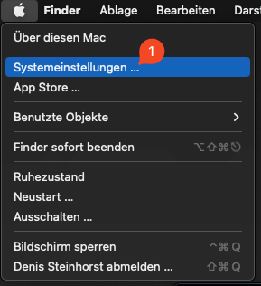
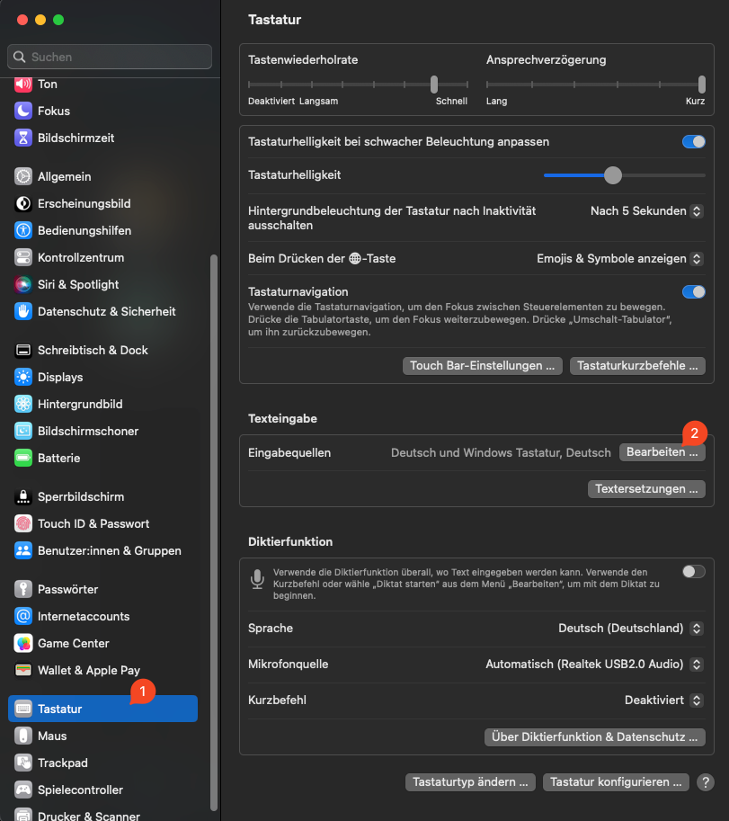

<h1 align="center">Windows User on a Mac [WUOAM]</h1>

   
  <a>
    &nbsp;
  </a>
   
   
  
- a Karabiner-Elements config & guide for MacOS Keyboard-Settings -

  <h1 align="center">&nbsp;</h1>

## About The Project

For more than 25 years, I have been working professionally and privately under Windows and Linux. Since I switched to a Mac for private use, I find it increasingly difficult to work efficiently with the keyboard layout and the hotkeys.

Not only that I had to google how to type an "@" symbol in the first minute as a fresh Mac owner to log in to the system, no. I also had to realize that everyday and over years rehearsed actions just don't work under Mac...

However, this challenge can be mastered relatively easily with a few settings and the additional program: "Karabiner Elements".

So if you:
- have difficulties to get used to the Mac Layout?
- often have to switch between Windows/Linux and Mac?
- just don't want to miss familiar gestures like CTRL+C/V and many more?

 

### Feel free to follow this guide! 🙃

(<a href="#readme-top">back to top</a>)

## Prerequisites
  In order to use this guide, you need to have the following installed:
 - [Karabiner Elements](https://karabiner-elements.pqrs.org/) (tested with 14.11.0)
 - Mac OS (tested with Ventura 13.3)

  
(<a href="#readme-top">back to top</a>)

## Mac Configuration

  
Click here to expand the Guide

   
  <ul>
    <li>
        1) Open the "System Preferences"
          
        
          
    </li>
    <li>
        2) Go to "Keyboard" and select the "Edit"-Button next to your language
          
        
          
    </li>
    <li>
        3) Click the little "+"-Icon to add a new Keyboard-Layout 
          
        
          
    </li>
    <li>
        4) "Scroll to the Bottom", select "Other", then "Windows Keyboard, LANG" and click "Add"
           
        INFO: If you dont have the "Windows Keyboard, LANG" option, you need to add the file: "win-germany.keylayout" in the "Keyboard Layouts" under: "/Library/Keyboard Layouts/" (for all users) alternatively you can place it under: "~/Library/Keyboard Layouts/" (only for you) as well.
          
        
          
    </li>
    <li>
        5) Confirm with "Done" and close the "System Preferences"
          
        
          
    </li>
    <li>
        6) Right click the "Keyboard-Settings"-Icon in the Menu-Bar and select "the Windows keyboard, LANG"
          
        
          
    </li>
  </ul>

(<a href="#readme-top">back to top</a>)

## Karabiner Elements Configuration
  

  
Click here to expand the Guide

   
  <ul>
    <li>
        1) Right click the "Karabiner-Elements"-Icon in the Menu-Bar and select "Open Preferences"
          
        
          
    </li>
    <li>
        2) Go to "Keyboard" and select the "Edit"-Button next to your language
          
        
          
    </li>
    <li>
        3) Click the little "+"-Icon to add a new Keyboard-Layout 
          
        
          
    </li>
    <li>
        4) "Scroll to the Bottom", select "Other", then "Windows Keyboard, LANG" and click "Add"
          
        
          
    </li>
  </ul>

(<a href="#readme-top">back to top</a>)

## Features
Since we've changed the general Keyboard-Layout of MacOS to use a Windows Keyboard Layout, our symbol keys like "@, {}, [], ()" are now where they belong. But we also want to use the Windows Hotkeys like CTRL+C/V instead of CMD+C/V etc. so additionally we need to flip some keys with "simple Modifications".

| Switch from | to | so that the key... |
| --- | --- | --- |
| `grave_accent_and_tilde` | `non_us_backslash` | under ESC becomes (^, °)  |
| `non_us_backslash` | `grave_accent_and_tilde` | next to LShift becomes (<, >, \|) |
| `left_command` | `left_control` | works for Copy & Paste etc. |
| `left_control` | `left_command` | works for Alt+Tab etc.|
| `right_command` | `left_option` | works as AltGR under Windows (for @, €, {, [, \, ], }, etc.) |

 

You may observed that we (except AltGR) modified only the keys for the left hand side, this is because we want the keybinding to work not only on an external keyboard but also on the MacBook's keyboard.

In order to use some windows hotkeys, we need to use the "complex Modifications" of Karabiner Elements.

| Hotkey (Windows Keyboard perspective) | Description 
| --- | --- |
| `LEFT_ALT + Tab` | opens "alt+tab" Tasklist 
| `LEFT_CTRL + Tab` | restores CTRL+Tab due to the LEFT_ALT+Tab switch 
| `LEFT_ALT + Q` | replaces CMD+Q with ALT+Q 
| `LEFT_CTRL + Backspace` | delete whole words 
| `LEFT_CTRL + ArrowLeft` | jumps to the beginning of the previews word
| `LEFT_CTRL + ArrowRight` | jumps to the beginning of the next word
| `LEFT_CTRL + Shift + ArrowLeft` | selects the previous word
| `LEFT_CTRL + Shift + ArrowRight` | selects the next word
| `LEFT_CTRL + LEFT_ALT + ENTF` | opens Activity Monitor (Task Manager) 
| `WIN(Left_Option) + R` | opens Terminal (run) 
| `WIN(Left_Option) + Tab` | opens Mission Control (windows expose) 
| `F5` | Refresh Website 

  
(<a href="#readme-top">back to top</a>)

## Known issues (FAQ)

  ### No Windows-Layout in the Keyboard-Settings (other)
  If you don't see the "Windows Keyboard, LANG" in the Keyboard-Settings, even though you put the "win-germany.keylayout"-file into place, you need to restart your Mac. (I don't know why, but it works)

   

  ### ( ~ becomes ± ) and ( | becomes ≤ )
  Occasionally it switches the keyboard layout back to the default one. (You can verify the switch easily since the info icon switches back to the [ A ] instead of the keyboard symbol) If this happens, just switch it back to the Keyboard-Entry and it will work again.

  FYI; It's a hotkey on mac or something, until I find out what it is, I'll just leave it here.

  
(<a href="#readme-top">back to top</a>)

## Contributing
  Contributions are what make the open source community such an amazing place to learn, inspire, and create. Any contributions you make are **greatly appreciated**.

If you have a suggestion that would make this better, please fork the repo and create a pull request. You can also simply open an issue with the tag "enhancement".
Don't forget to give the project a star! Thanks again!

  
(<a href="#readme-top">back to top</a>)

## Contact
Denis Steinhorst - contact@steinhor.st

Project Link: [https://github.com/denissteinhorst/windows-user-on-a-mac](https://github.com/denissteinhorst/windows-user-on-a-mac)

(<a href="#readme-top">back to top</a>)

## Closing words
  This Configuration is always in development. If you have any suggestions, feel free to open an issue or a pull request. I'm always happy to hear from you!
  
(<a href="#readme-top">back to top</a>)

## Documentation

|  | Website | Description | Documentation |
| --- | --- | --- | --- |
| **Karabiner Elements** | [Karabiner Elements](https://karabiner-elements.pqrs.org/) | Karabiner Elements is a powerful utility for keyboard customization on macOS. | [karabiner-elements docs](https://karabiner-elements.pqrs.org/docs/) |
| Mac OS | [Mac OS](https://www.apple.com/macos/) | Mac OS is the operating system of the Macintosh computers. | [mac os knowledge-base](https://support.apple.com/kb/index?page=search&q=settings&product=&doctype=&currentPage=1&includeArchived=false&locale=en_US&src=globalnav_support&type=organic) |
| **Windows** | [Windows](https://www.microsoft.com/en-us/windows) | Windows is the operating system of the Windows computers. | [windows knowledge-base](https://support.microsoft.com/en-us/windows) |